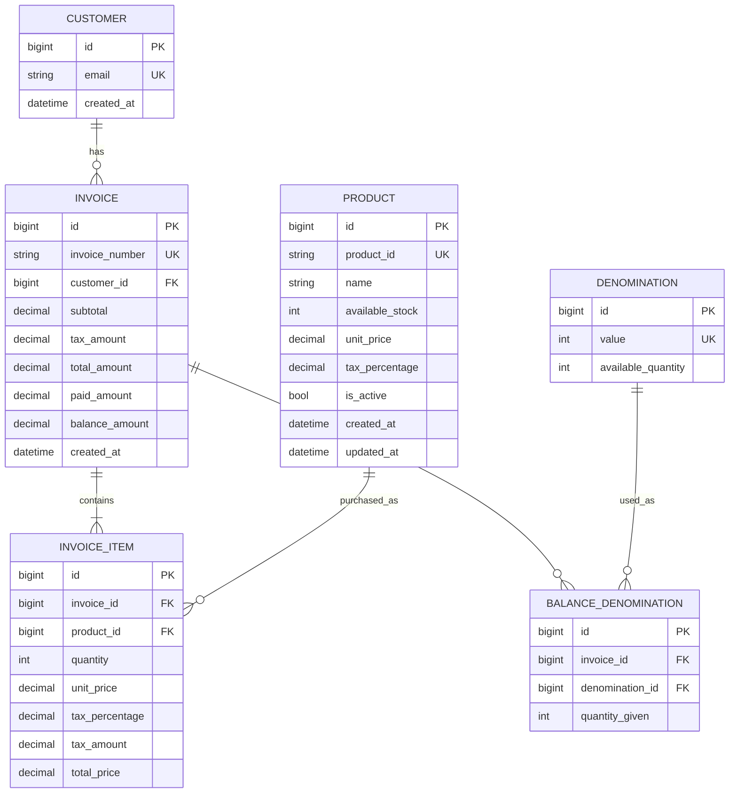

# Billing System

A production-minded Django 5 and Django REST Framework billing application for generating invoices, managing product stock, returning balance denominations, viewing customer purchase history, and sending invoice emails asynchronously.

The project is intentionally structured around thin views, service-layer business logic, repository/query helpers, serializer validation, and transactional invoice generation.

## Architecture

- **Framework:** Django 5.x, Django REST Framework
- **Database:** PostgreSQL preferred, SQLite supported for local development
- **Frontend:** Django Templates, Bootstrap 5, vanilla JavaScript
- **Async:** Celery with Redis for invoice email delivery
- **Testing:** pytest, pytest-django, pytest-cov
- **Static files:** WhiteNoise

## Folder Structure

```text
billing_system/
├── apps/
│   ├── common/
│   │   ├── constants.py
│   │   ├── exceptions.py
│   │   ├── mixins.py
│   │   ├── pagination.py
│   │   ├── utils.py
│   │   └── validators.py
│   ├── products/
│   │   ├── admin.py
│   │   ├── models.py
│   │   ├── repositories.py
│   │   ├── selectors.py
│   │   ├── serializers.py
│   │   ├── services.py
│   │   ├── urls.py
│   │   ├── views.py
│   │   └── tests/
│   ├── customers/
│   │   ├── admin.py
│   │   ├── models.py
│   │   ├── repositories.py
│   │   ├── selectors.py
│   │   ├── serializers.py
│   │   ├── services.py
│   │   ├── urls.py
│   │   ├── views.py
│   │   └── tests/
│   └── billing/
│       ├── admin.py
│       ├── denomination_service.py
│       ├── email_service.py
│       ├── invoice_service.py
│       ├── models.py
│       ├── repositories.py
│       ├── selectors.py
│       ├── serializers.py
│       ├── services.py
│       ├── tasks.py
│       ├── urls.py
│       ├── views.py
│       ├── web_urls.py
│       └── tests/
├── config/
│   ├── settings.py
│   ├── urls.py
│   ├── asgi.py
│   └── wsgi.py
├── static/
├── templates/
├── manage.py
├── pytest.ini
├── requirements.txt
└── .env.example
```

## URL Map

### Web Pages

| Method | URL | Name | Purpose |
| --- | --- | --- | --- |
| GET | `/` | `billing_web:billing-page` | Billing form page |
| GET | `/invoices/<id>/` | `billing_web:invoice-page` | Render generated invoice |
| GET | `/history/` | `billing_web:purchase-history-page` | Search and view purchase history |

### API Endpoints

| Method | URL | Name | Purpose |
| --- | --- | --- | --- |
| GET | `/api/products/` | `products:product-list` | List active products |
| GET | `/api/invoices/` | `billing:invoice-list-create` | List invoices |
| POST | `/api/invoices/` | `billing:invoice-list-create` | Generate an invoice |
| GET | `/api/invoices/<id>/` | `billing:invoice-detail` | Retrieve invoice details |
| GET | `/api/customers/<email>/history/` | `customers:customer-history` | Retrieve purchase history by customer email |
| GET | `/admin/` | Django admin | Manage products, denominations, customers, and invoices |

All endpoint handlers are implemented through serializers, selectors, repositories, and services.

## ER Diagram



## Local Setup

Create and activate a virtual environment:

```bash
cd billing_system
python3.12 -m venv .venv
source .venv/bin/activate
pip install -r requirements.txt
```

Create an environment file:

```bash
cp .env.example .env
```

Use SQLite locally by keeping:

```env
DATABASE_ENGINE=sqlite
```

Run migrations:

```bash
python manage.py makemigrations
python manage.py migrate
```

Start the development server:

```bash
python manage.py runserver
```

## PostgreSQL Setup

Set these values in `.env`:

```env
DATABASE_ENGINE=postgres
POSTGRES_DB=billing_system
POSTGRES_USER=billing_user
POSTGRES_PASSWORD=billing_password
POSTGRES_HOST=localhost
POSTGRES_PORT=5432
```

The same codebase works with SQLite or PostgreSQL through environment configuration.

## Celery

Redis is the preferred broker:

```env
CELERY_BROKER_URL=redis://localhost:6379/0
CELERY_RESULT_BACKEND=redis://localhost:6379/0
```

Run the Celery worker:

```bash
celery -A config worker -l info
```

For local tests, eager execution can be enabled:

```env
CELERY_TASK_ALWAYS_EAGER=True
CELERY_TASK_EAGER_PROPAGATES=True
```

## Seed Data

Insert local seed data:

```bash
python3 manage.py seed_data
```

It will insert sample products and denominations such as `500`, `200`, `100`, `50`, `20`, `10`, `5`, `2`, and `1`.

## API Documentation

### Generate Invoice

`POST /api/invoices/`

```json
{
  "customer_email": "customer@example.com",
  "paid_amount": "1000.00",
  "items": [
    {
      "product_id": "P001",
      "quantity": 2
    }
  ],
  "denominations": [
    {
      "value": 500,
      "count": 2
    }
  ]
}
```

Expected behavior:

- Validate email, products, quantities, stock, paid amount, and duplicate product IDs.
- Calculate subtotal, tax, exact net price, rounded-down net price, paid amount, and balance with `Decimal`.
- Treat submitted denomination counts as the shop's available cash drawer counts for that bill.
- Produce balance denominations with a greedy algorithm that respects submitted or stored inventory.
- Save customer, invoice, invoice items, and balance denominations inside `transaction.atomic()`.
- Deduct product stock and denomination inventory.
- Queue invoice email asynchronously.

## Business Rules

- Money must use `Decimal`, never `float`.
- Invoice generation must run inside `transaction.atomic()`.
- If invoice generation fails, all stock and denomination changes must roll back.
- Product IDs must be unique.
- Stock and denomination quantities cannot be negative.
- Tax percentage must be between `0` and `100`.
- Paid amount must be greater than or equal to the rounded-down net price.
- Duplicate product IDs are not allowed in the same invoice request.
- Balance denominations must exactly match the balance amount.

## Testing

Run tests:

```bash
pytest
```

Run with coverage:

```bash
pytest --cov=apps --cov-report=term-missing
```

Planned coverage areas:

- Models
- Repositories
- Services
- Views
- API endpoints
- Invoice generation
- Tax calculation
- Stock deduction
- Transaction rollback
- Email task dispatch
- Purchase history
- Denomination algorithm
- Serializer validation
- Negative cases
- Concurrent invoice generation

## Docker

Docker includes the web application, PostgreSQL, Redis, and a Celery worker:

```bash
docker compose up --build
```

## Assumptions

- Invoice numbers will be generated server-side.
- Product prices and tax percentages are snapshotted into invoice items at purchase time.
- Customer records are created or reused by email.
- Balance denomination availability represents cashier cash inventory; when the billing page submits counts, those counts are used as the current shop availability for that transaction.
- Although the original prompt says float for price and tax, the implementation uses `Decimal` to avoid money rounding errors.
- The HTML frontend uses traditional Django pages, not a SPA.

## Production Improvements

- Add authentication and role-based admin/staff access for APIs.
- Add rate limiting for invoice creation.
- Add structured JSON logging in containerized deployments.
- Add database-level constraints and indexes for high-volume invoice searches.
- Add observability with metrics and tracing.
- Add retry policies and dead-letter handling for async email failures.
- Add PDF invoice generation and durable invoice attachments.

## Current Status

Completed:

- Project initialization and settings
- Models and migrations
- Repositories and selectors
- Service-layer invoice generation
- Serializer validation
- API endpoints
- Django template pages
- Celery invoice email task
- Seed data command
- Dockerfile and docker-compose.yml
- Focused pytest coverage
